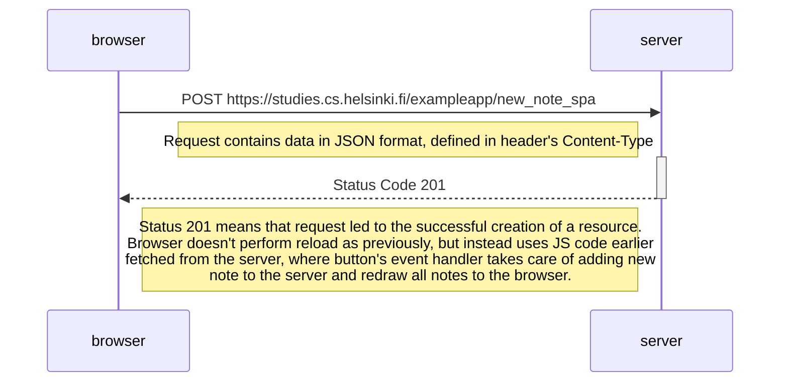

```mermaid
sequenceDiagram
    participant browser
    participant server

    browser->>server: POST https://studies.cs.helsinki.fi/exampleapp/new_note_spa
    Note left of server:  Request contains data in JSON format, defined in header's Content-Type
    activate server
    server-->>browser: Status Code 201
    deactivate server

    Note right of browser: Status 201 means that request led to the successful creation of a resource. <br/> Browser doesn't perform reload as previously, but instead uses JS code earlier <br/> fetched from the server, where button's event handler takes care of adding new <br/> note to the server and redraw all notes to the browser.
```
